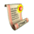
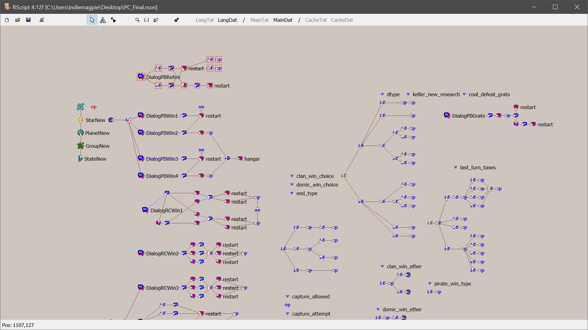

<div align="center">

#  RScript

Script editor for [Space Rangers HD](https://store.steampowered.com/app/214730/Space_Rangers_HD_A_War_Apart/).



</div>

## Current features
* Node-based script system
* Compilation into game scr format
* Opening and editing dat files
* Decompilation of scr into source rson format
* Creation of a text dump of the scr script
* When an error is detected, the character index in the current object is reported
* Option "Export out text to Lang" - exports script dialogues to Lang, Script section
* Export of an rson script into the new .rsm format
* CLI for headless build/decompile/export

## .rsm format & rsmc compiler
`.rsm` is a small DSL, the input format for rsmc - a standalone console compiler,
independent from RScript/RSON/GUI, that turns .rsm (with import/export) straight into .scr.

The declarations (import/export/function, object-literal options) are JS-like; the actual code
inside a function() { ... } body is a separate, C-like game script mini-language.

The source code will be made public after the C++ rework.

Structure:
```
import from './vars.rsm'; // Any name module
import from './world.rsm';

export function onTurn() { // The turn code can be split into multiple rsm modules, and each must have an export function onTurn()
    if (CurTurn() % 10 == 0) {
        GTestFirstStart = CurTurn() + Rnd(15, 30);
    }
}
```
Format for ChangeState / DChange / DAdd:
```
// by index and by name
ChangeState(2); ChangeState('PatrolState');
DChange(0); DChange('NewMessage1');
DAdd(1); DAdd('EndAnswer1');
```
Build:
```
rsmc build <entry.rsm> -o <out.scr> [--lang-txt <Lang.txt>] [--lang-dat <Lang.dat>]
```

See more in the [Example](Example) folder.

Named types:
* `race` / `owner` (planet, ship, group): Maloc, Peleng, People, Fei, Gaal - planet's `owner` also
  takes Kling, None, Pirate, ByPlayer; ship/group's also takes Kling, Pirate, ByPlayer
* `economy`: Agriculture, Industrial, Mixed
* `government`: Anarchy, Dictatorship, Monarchy, Republic, Democracy
* `type` (ship, group): Ranger, Warrior, Pirate, Transport, Liner, Diplomat, Blazer0-7, Keller0-7,
  Terron0-7, Tranclucator
* `place` type: free, nearPlanet, inPlanet, toStar, nearItem, fromShip, coords
* `item.mainType`: Equipment, Weapon, Goods, Artefact, Useless, Unknown - each with its own
  `item.type` list (e.g. Weapon1-18 for Weapon)
* `item.owner`: Maloc, Peleng, People, Fei, Gaal, Kling, None, PirateClan

## VS Code plugin for .rsm

[rsmc.rsm-language-0.1.0](rsmc.rsm-language-0.1.0/) adds .rsm syntax highlighting and
go-to-definition - see its [README](rsmc.rsm-language-0.1.0/README.md) for install steps.
